# :handshake: README :handshake:

## :information_source: About

Community-connect is a two sided-marketplace app designed to bring people willing to volunteer their time together with local charities or community groups. It was developed in accordance with the requirements of Coder Academy T2A2 Marketplace Project.

## :link: R9 R10 Links for this app

Github - <https://github.com/bronwyncarr/marketplace>

Heroku - <https://volunteer-marketplace.herokuapp.com/>

Trello - <https://trello.com/b/KXzaMOYT/marketplace-app>

Slide Deck - <https://docs.google.com/presentation/d/1zumTJ2SNfjI9uJmrjzWBylWqo9JzHq-ScXSFPZug9mo/edit?usp=sharing>

## :thinking: R7 Identification of the problem you are trying to solve by building this particular marketplace app

Volunteers are relied upon to provide many services and functions critical to Australian society. However, since 2010, The Australian Bureau of Statistics reports that the amount people who volunteer is decreasing. A report by Volunteering Australia cited some of the common barriers people faced to volunteering were:

- Did not have time – 67%
- Unable to make a long-term commitment – 62%
- No one asked – 45%
- Did not know how to become involved – 22%

Due to barriers, the amount of people volunteering in our community is decreasing. This problem affects small charities that rely 100% of volunteers in addition to larger ones that still have a large volunteer workforce.

## :question: R8 Why is it a problem that needs solving

Charities and community groups play a critical role supporting our society and a wider range of services we rely on. Most notably, in Australia over 3 million people live below the poverty line and almost half of them regularly rely on food relief. However, almost everyone in Australia would draw benefit from the wide range of services charities and local community groups provide. These include services such as: keeping beaches safe, looking after elderly, fighting fires, running local facilities, accessing medical care and championing equality; in fact, there are over 50,000 Australian registered charities.

COVID19 has had devastating economic and social effects on our community contributing to an increase in alcohol and addiction related issues, food insecurity, isolation, loneliness, financial stress, job loss, family stress and domestic violence. This has increased the demands placed on Australian charities including a 47% increase in the demand for food relief and a 25-30% increase in requests for assistance for mental health services.

Many charities are completely reliant on volunteers and are facing unprecedented demand for assistance. In addition to the social benefits, volunteer contribute billions of dollars to the Australian economy and in general, personally benefit from an increase to their physical and mental wellbeing.

## :clipboard: R11 Description of your marketplace app

### Purpose

The purpose of this app is to connect charities/community groups and volunteers. It will remove some of the barrier’s volunteers face, allow charities to raise awareness and support local connections. Charities can register requests for assistance for a specific task which volunteers register for on a one-of basis. Volunteers can become aware of what opportunities exist in their local area and see the date, time commitment and skills required. This will remove some of the barriers identified.

| Problem | Targeted solution |
| ------------- | ------------- |
| Did not have time | Volunteers can see the time commitment and date so they can fit it around a busy or unpredictable schedule without on-going commitment |
| Unable to make a long-term commitment | Volunteers make a one-off commitment to a specific task with no on-going requirment |
| No one asked | Community groups can post requests for assistance |
| Did not know how to become involved | Raises awareness of the volunteering opportunities |

Benefits include:

- Assist charities to find volunteers to help complete task
- Raise awareness of the importance role charities play in our society
- Allows people to build social connections within their local community
- Allow people to give back to their community
- Encourage people to be considerate of others
- Encourages bridging social and cultural divides by bringing people together
- Allows people to share knowledge and learn new skills
- Encourages a sense of achievement by being able to contribute to specific tasks
- Encourages a sense of fulfilment by assisting others
- Enables more people to be involved in their community who might previously not been

### Features

The app will allow charities to log in and post information on a one-off request for assistance such as building garden beds at a neighbourhood house or holding a second-hand book sale and volunteers can express interest in volunteering for these events.

Everyone must have an account and log in to use the app. There are three incremeintal roles a user can have.

| User | Permissions |
| ----------- | --------- |
| General | Can view requests and express interest. Can create a charity however the charity won't be able to post requests until approved by admin. |
| Organiser | General permissions + can CRUD request for all charities they are associated with. Can edit charity information and view who has expressed intrerests in tasks. Must be approved by admin to become organiser to confirm legitimate. Also must be added to organisers table for each charity they want to be associated with. |
| Admin | Has total control to manage content. Must approve organiser role and update users in organisers table with the charity they represent. |

Anyone who is approved by admin as an organiser and either created the charity themselves or approved by admin as part of that charity, can manage all functions of that charity. A user may be an organiser at more than one charity. They can post requests including a picture, title, summary, description, date, time commitment, list of skills required, address and a map. Anyone who is an organiser of that charity can see a full list of all requests made by that charity and update or delete these details at any time. Requests are sorted into upcoming (today onwards) or previous. Requests do not time expire for potential data analytical purposes.

Volunteers can log in and see a list of all the requests for assistance sorted by date. They can search for a particular task by name or by the skillset. They can click on a request to get more information about what is required including the time commitment, date, skills required and location. If they are interested in a task they can register.

If a volunteer registered their interest in a task an email will be sent to them confirming this and it will be added to the expression of interests list. Volunteers can view a list of EOIs for their records and modify this list.

Any organiser of a charity can view a list of the contact details of everyone who has expressed interest in each task associated with that charity so they can contact them with further information or to make arrangements. An orgasniser can also update the information about the charity, it's picture, category or description.

To demonstrate the features I have seeded data and created 3 basic logins:

| Role | Username | Password |
| ------------------ | ----------------- | ----------|
| General | a@test.com | 123456 |
| Organiser | b@test.com | 123456 |
| Admin | c@test.com | 123456 |

### Sitemap

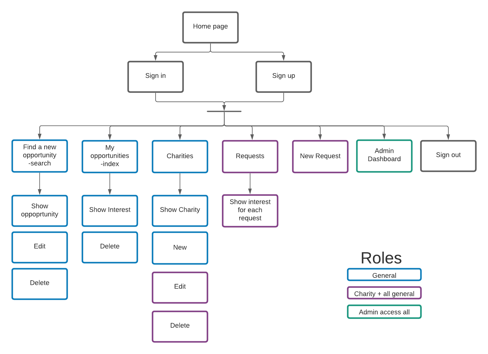

### Screenshots

Home page:
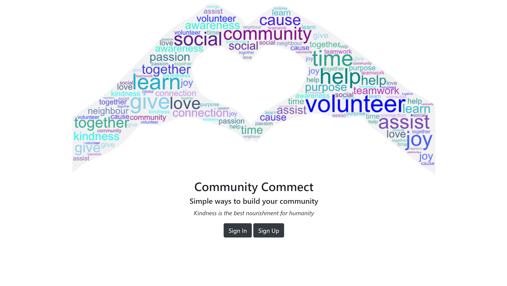

Sign in page:
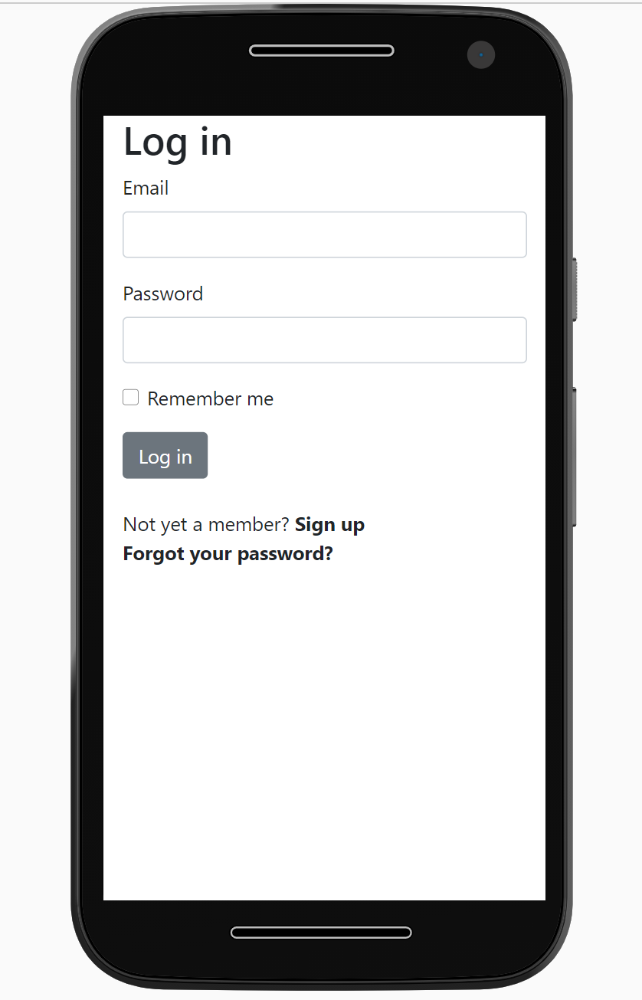

Sign up page:
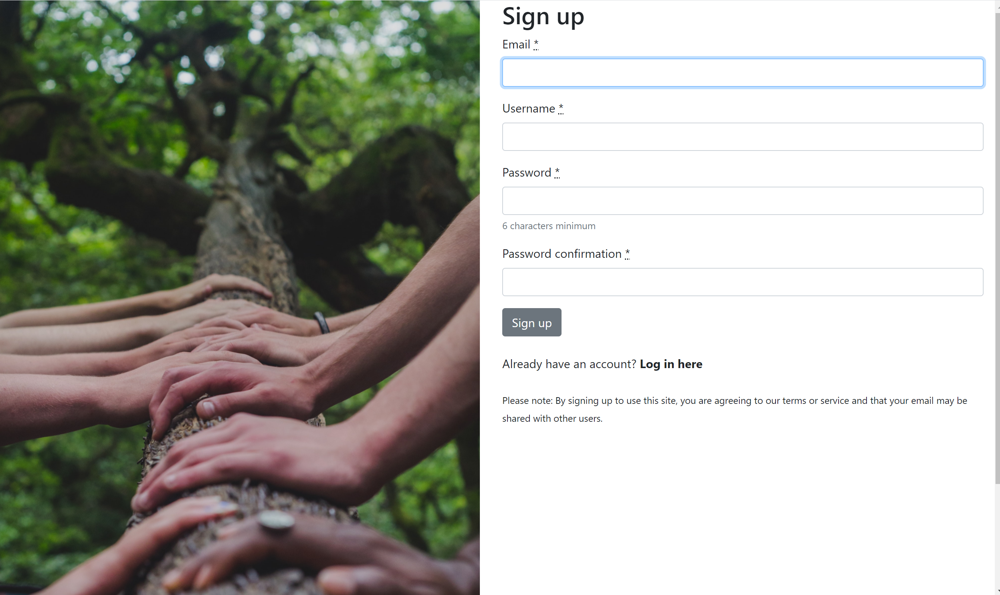

Index page desktop:
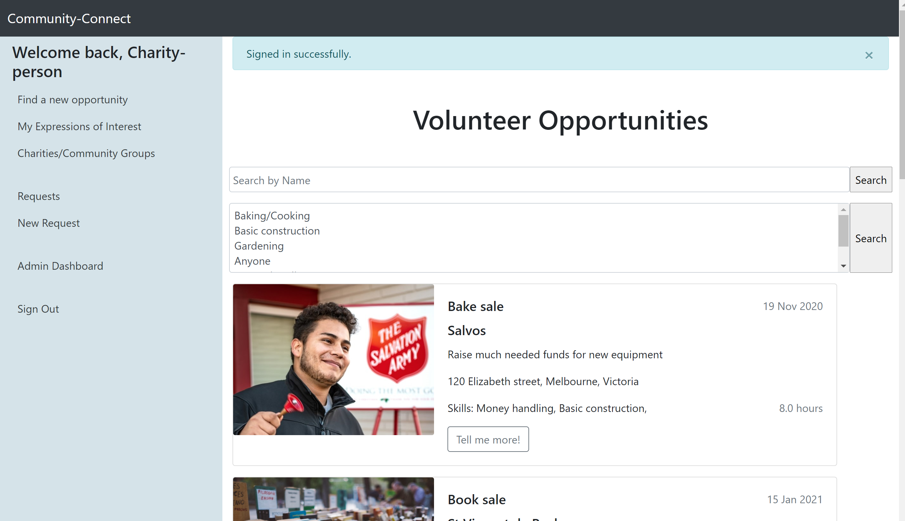

Index page mobile:
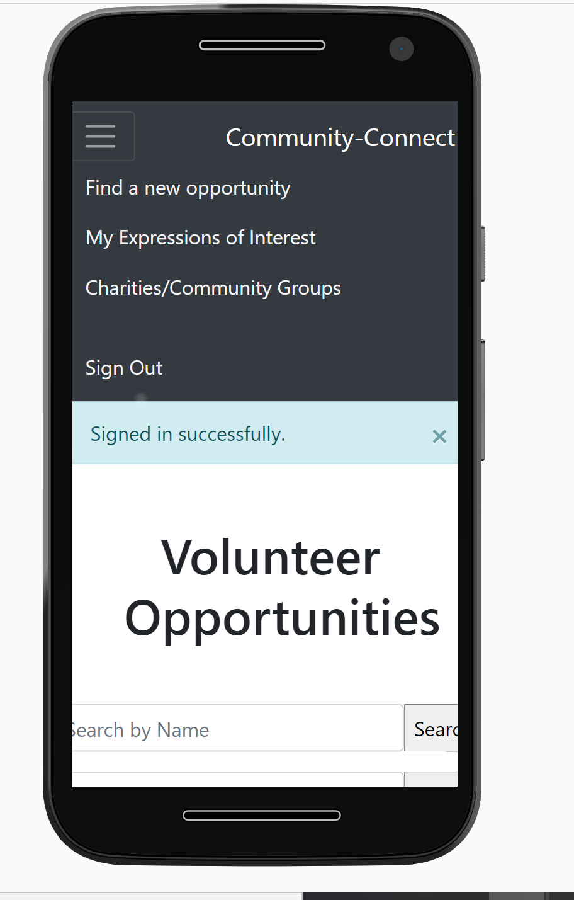

Show Task Part 1:
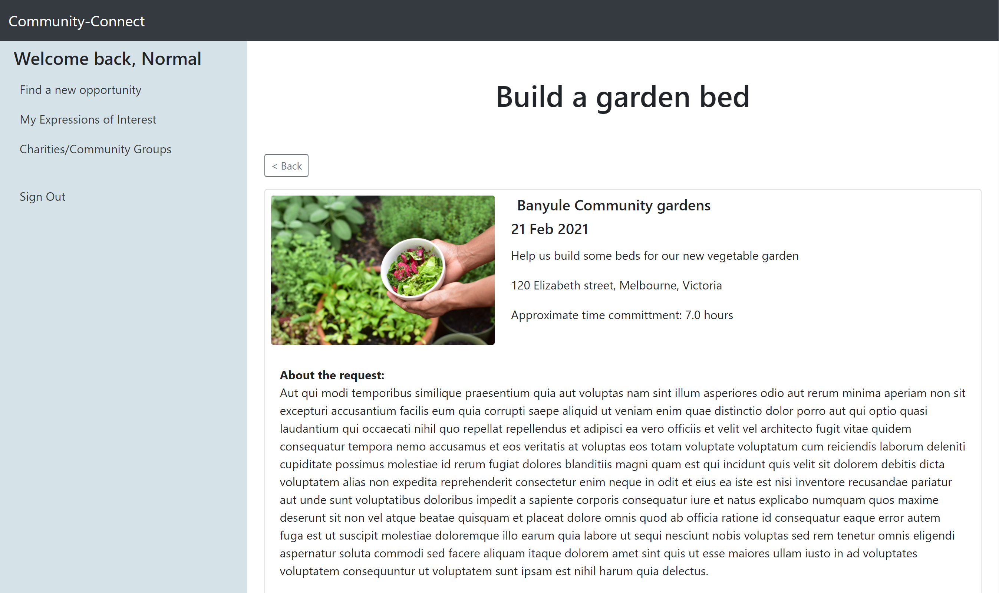

Show Task Part 2:
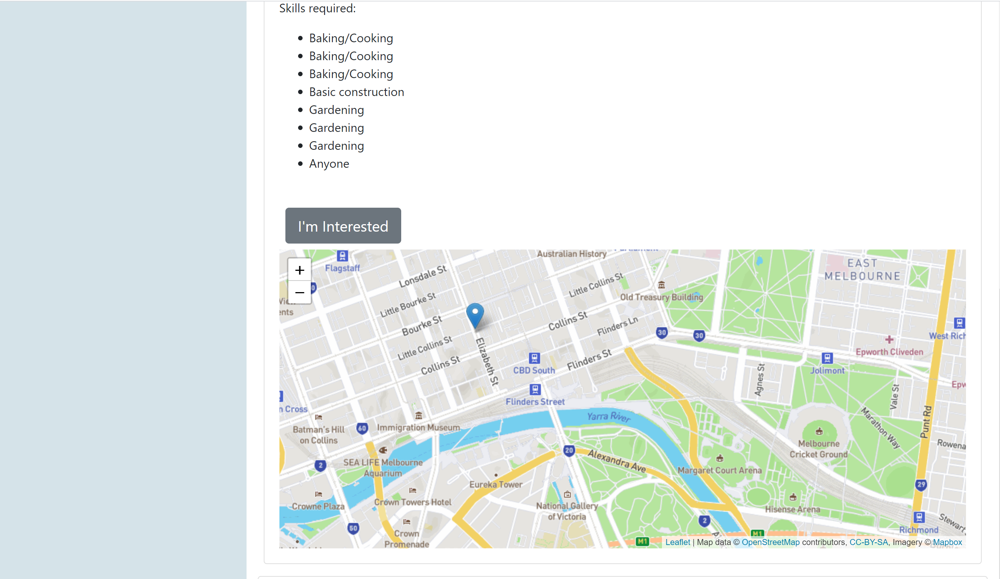

Interests Index:
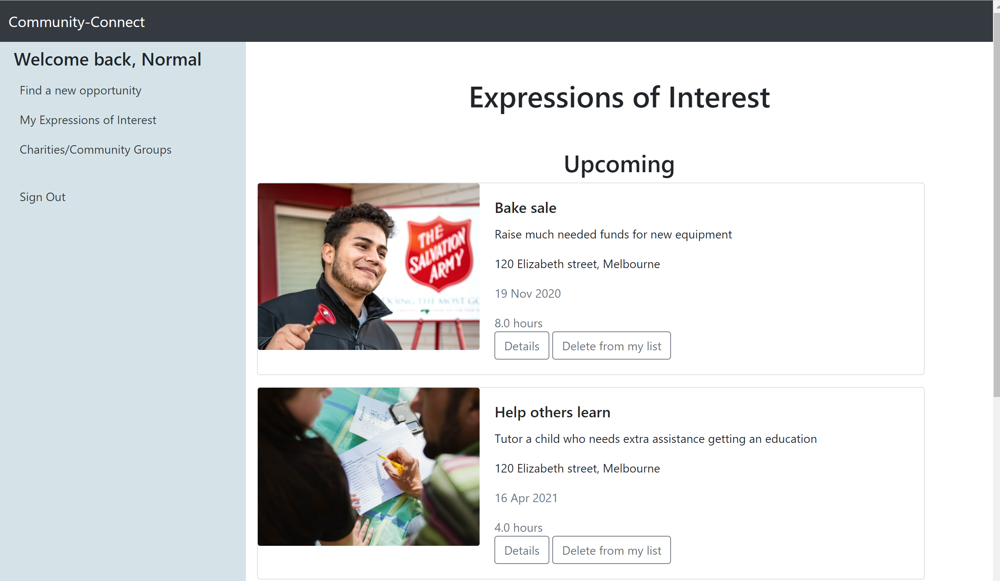

Index of Charities:
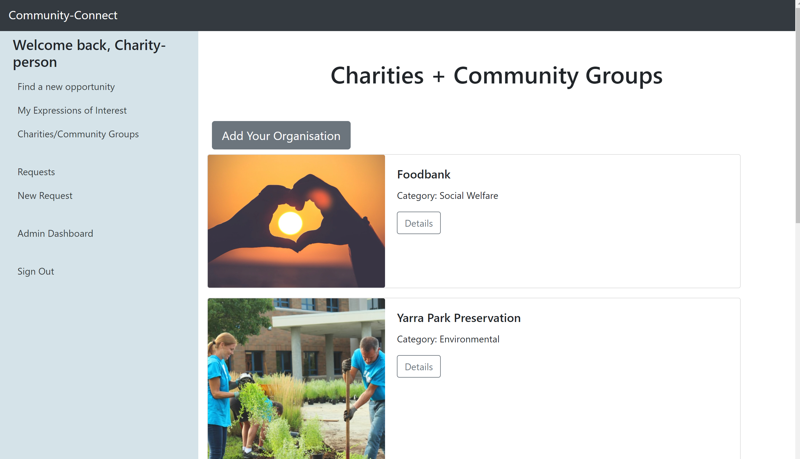

Requests made by user's Charities:
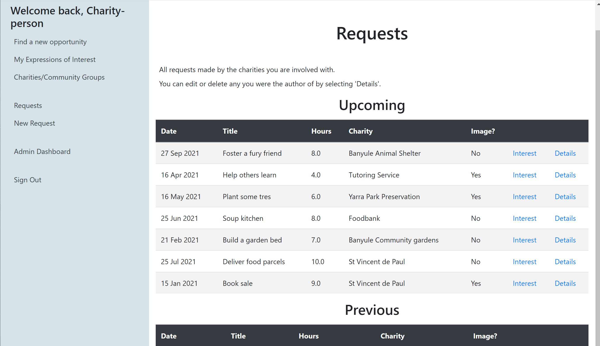

Charitites record of interests in their request:
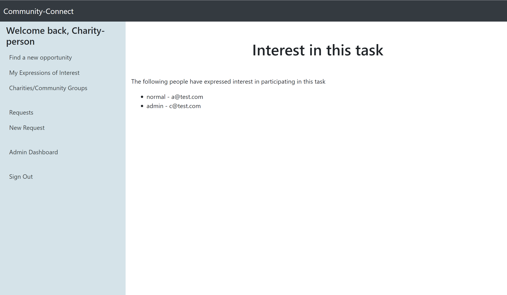

Creating a new request Part 1:
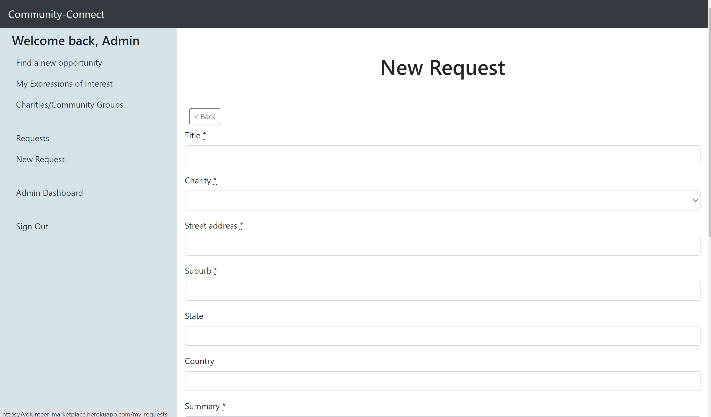

Creating a new request Part 2:
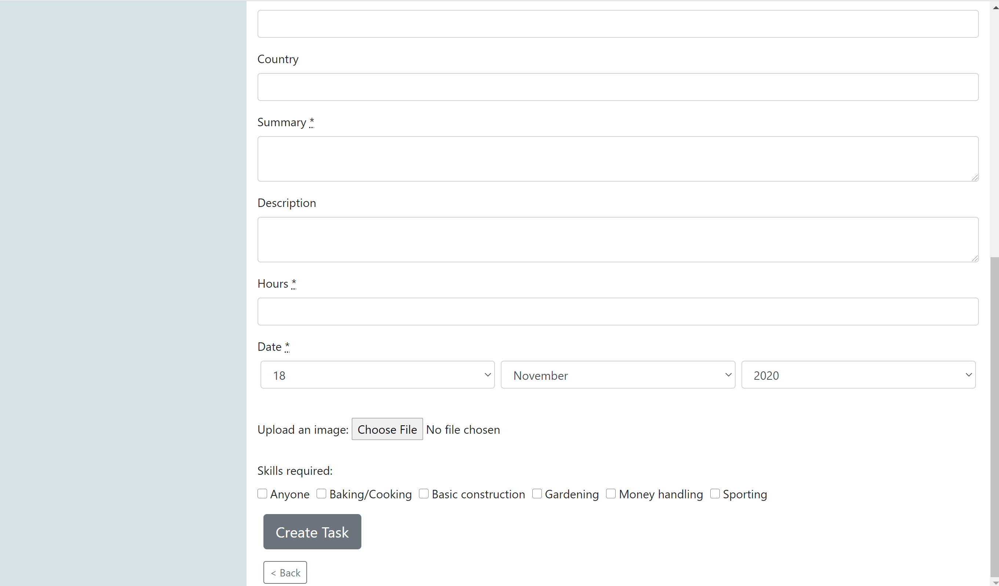

Edit a request Part 1:
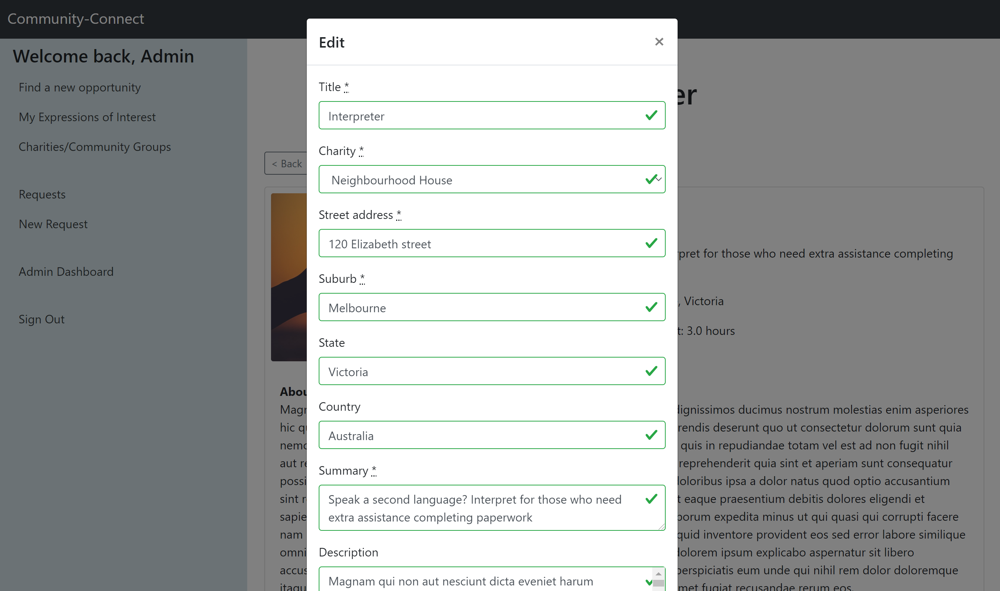

Edit a request Part 2:
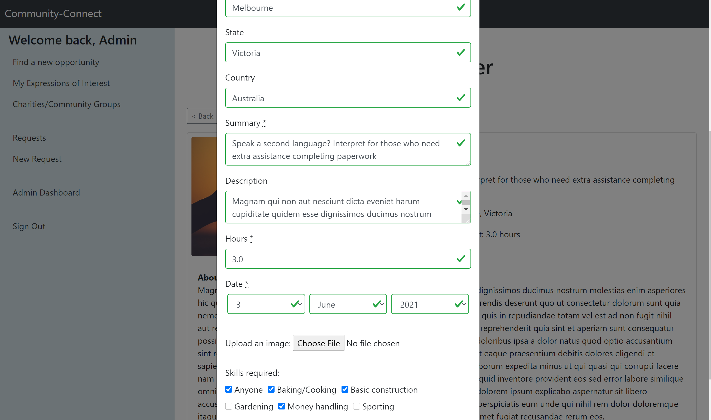

### Target audience

This app is targeted people who wish to volunteer and charities or local community groups who require assistance. The app will appeal to those who already actively volunteer in their community but is also designed to break down some barriers to volunteering and encourage more people to become involved. This will include people who previously:

- were unaware of non-stereotypical volunteer opportunities that they could do
- thought they didn’t have the time or availability
- didn’t want to make an ongoing commitment
- thought they didn’t have any useful skills to help
- thought there wasn’t a need
- want to help but didn't know how/where to start

Target audience examples might include:

- Charity/local groups who need extra assistance
- Charity/local groups who require an increase in demand such as in lead up to Christmas
- Charity groups who require a task outside the skillset of their normal volunteers
- People who want to build social connections in their community especially if they now work from home/lost their job due to COIVD19 or are new to the area.
- People who want to volunteer as a family but need tasks suitable to their family
- People who want to volunteer but at a time convenient to them without an ongoing commitment
- People who want more information about what is required before having to commit

### Techstack

Teck stack used for this project is:

| Tech | Usage |
| ------------- | ------------- |
| Ruby on Rails | Back end |
|Javascript | Dynamic content |
| Postgres database | Relational database |
| HTML with EMB | Controls the content to be displayed |
| Bootstrap CSS | Framework for most styling |
| SASS | In addition to bootstrap for additional styling |
| Third party services and gems | [As detailed below](#r16-detail-any-third-party-services-that-your-app-will-use) |

| Other | Usage |
| ------------- | ------------- |
| Heroku | Deployment |
| Github | Version control |
| Trello | Project management planning |

### :people_holding_hands: R12 User stories for your app

#### Guest

- As a guest I want an attractive home page.
- As a guest I want an easy sign up process so that I can use the app further.

#### Volunteer

- As a volunteer I want to be able to have an account and log in.
- As a volunteer I want to be able to see opportunities so that I can see what's available.
- As a volunteer I want to be able to search based on a name or my skillset so that I can find opportunities suitable to me.
- As a volunteer I want to be able to view details about a task before commiting.
- As a volunteer I want to be able to express interest in a task.
- As a volunteer I want to get feedback that my interest was registered (email).
- As a volunteer I want to be able to save requests I’ve expressed interest in so that I can refer back to them.
- As a volunteer I want to be able to learn more about the charities/community groups listed.

#### Charity/Community group

- As a charity I want to be able to list requests I need assistance with and include a picture so I can attrach volunteers.
- As a charity I want to be able to add relevent information so that I can attrach suitable volunteers based on the requirements.
- As a charity I want to be able to manage my listed requests so that I can change or delete them as necessary.
- As a charity I want to be able to see who has expressed interest in requests and access their contact information so that I can get in touch with them to organise further.
- As a charity I don't want an email for each person who is interested (too many) but an convenient summary of everyone.
- As a charity I want all organisers to be able to manage our posts but not anyone else so that we can control the content.

#### User

- As a user I want a navigation section and a clean layout so I can easily use the app.
- As a user I want to be able to add my charity so that I can start listing requests.

#### Admin

- As a admin I want control over all content so that I can manage and delete anything that isn't appropriate.
- As an admin I want to be able to check/approve of someone before they can start posting for a charity so that I can make sure they are really a person and legitimate.

#### Developer

- As a developer I want clean, commented code so I can easily understand what has already been writen.
- As a developer I want a readme that explained about the project so I can understand it's purpose.

### :triangular_ruler: R13 Wireframes

1. Wireframe home
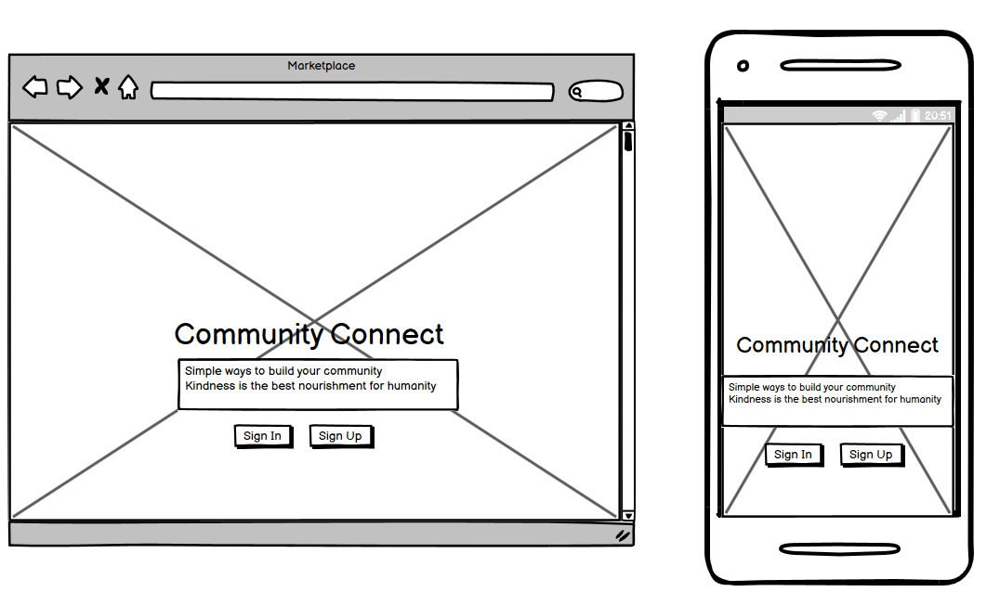

1. Wireframe login screen


1. Wireframe Main Task Index Page


1. Wireframe Task Show page 1


1. Wireframe Task Show page 2
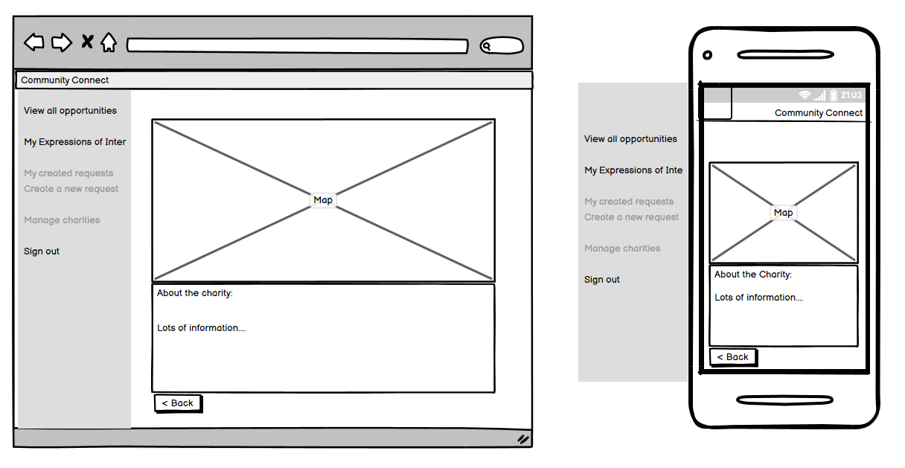

1. Wireframe Charity Index


1. Wireframe List of Requests made


### :arrow_down: R14 An ERD for your app

See below

### :closed_lock_with_key: R15 Explain the different high-level components (abstractions) in your app

There are a number of high-level components that provide abstraction in my rails application. This allows me to leverage significant code already written through inheritance and by complying with conventions access a lot of functionality without having to manually write it myself from scratch. By following convention and the Model-View-Controller (MVC) pattern Rails uses, I have been able to take advantage of the abstraction offered by Active Record, Action View and Action Controller.

#### Active Record

Active Record represents the ‘Model’ which is responsible for managing the business logic and data of my application. Active Record extracts away some of the complexity of the creation and use of objects when they have persistent data storage such as in a database.

The objects in my application are connected to the data held in tables in a relational database through object relational mapping (ORM). This allows properties and relationships of the objects to be stored and retrieved from the database using Ruby language rather than having to write SQL statements directly.

When I create a model eg. `task`, this model automatically inherits from ApplicationRecord, which inherits from ActiveRecord which in turn inherits from Base.

By inheriting from Active Record, my `tasks` model will be map to a `tasks` table in the database. Due to inheritance I can straight away access various create, read, update and delete (CRUD) methods in addition to other built in methods such as validations.

#### Action View

Action View represents the ‘View’ and is responsible for the display of content to be rendered from each controller action. My `tasks` controller will communicate with the `tasks` view that will determine what is displayed from that controller action. The final output that is rendered is a combination of three Rails components, templates, partials and layouts.

##### Templates

Templates can be written using a combination of embedded ruby and html or XML Markup, I have chosen to use embedded ruby (ERB) so my view files have the extension .html.erb. This allows me to write ruby ‘logic’ code inside a HTML documents by enclosing it in `<% %>` or `<%= %>` For example:

```ruby
    <ul>
      <% @task.skills.each do |skill| %>
        <li><%= skill.name %></li>
      <% end %>
    </ul>
```

##### Partial templates

Partial templates or “partials’ allow me to extract pieces of code into a separate file where they can be reused thoughout my templates. Partials can be rendered with the command `render` for example:

```ruby
<%= render 'form', task: @task %>
```

I have used partials in my application to remove duplicate code from the `new` and `edit` methods.

##### Layouts

Layouts can be used to define a common view template once that can be used for multiple pages. In my application I have a sperate devise layout that is shown when the user is signing up or in to the layout shown once they are logged in which contains a navbar and sidebar.

#### Action Controller

Action Controller represents the ‘controller’ and is responsible for interpreting the request, communicating between the model and view, and replying to the request. When a HTTP request is received, the routing will determine which action of which controller should handle the request. An instance of that controller is then created and the method runs.

When I create a new controller, for example `TasksController`, it automatically in herits from Application Controller which inherits from Action Controller which in turn inherits from base. This gives me many helpful methods that I can access without having to construct them myself.

The Action Controller makes parameters or params that are passed in through the query string, after the `?` available. I have been able to use this functionality to target rows in my database by id number based on the param from the query string for example:

```ruby
@task = Task.find(params[:id])
```

#### Active Storage

Active storage allows me to use cloud storage for images uploaded to my deployed application. Active storage uses an `active_storage_blobs` and an `active_storage_attachments` table in the database. When a user creates a new task or charity on my application, they can add a picture that is stored in an AWS S3 bucket but can be referenced in my application. I have to add credentials for my AWS account and set the config for active storage to amazon and the rest of the logic is abstracted away.

##### Action Mailer

Action mailer is used in my app to send an email to a volunteer who expresses interest in a task. The mailer class I have created `InterestMailer` inherits from `ActionMailer` class which inherits from Base. This way I get all the built in logic for sending emails and just need to configure it for my use.

##### Asset pipeline

In addition to cloud storage, I have resources stored as assets in the application, these include application images such as my home page image and SASS stylesheets. The assets pipeline provides a way to concatenate and minfy these assets. This reduces the number of requests the browser has to make when rendering my webpage and precompiles the SASS into CSS. Again, this is all abstracted away from me so I don't have to write the logic for it to happen.

### :three: R16 Detail any third party services that your app will use

**AWS S3**
Cloud storage for all images that are uploaded when the app is deployed. A bucket is created on the AWS online console to hold data and the AWS keys are encrypted in the app.

**Bootstrap**
A HTML, CSS, and JS framework for providing general styling and rapidly building components. I have used several bootstrap components such as the reusable card on the index page and the drop-down nav on a mobile version. I was able to add bootstrap and it’s dependencies such as jquery through the yarn package manager and prepending the plugins into in to the environment file.  

**CanCanCan**
CanCanCan is a gem I used to handle authroisation in my application. It is a Ruby/Ruby on Rails specific library that restricts what resources a user can and cannot access. I defined the permissions in the ability file and then referenced then in determining what the user sees on the views or what pages they can access. I also user the rails helper to load and check permissions of some models automatically.

**Devise**
I used the devise gem to handle the authentication in my application. To progress from the landing page users must sign in our sign up. Devise hashes the password to store it securely in the database. I also use the devise timeout-able feature to limit an inactive session for further security.

**Geocoder**
Geocoder is a gem that converts addresses into a latitude and longitude and vice versa. When a task is created in my app the user is prompted to put in a street address. Geocoder then converts this into a lat/long and saves that in the database along with the address. This can then be accesses by mapping software to pin-point a location. 

**GoogleMaps API**
GoogleMaps by receiving geocoder data and allowing the conversion from address to lat/long. Requires an encrypted key that is stored in the credentials file.

**Leaflet**
The JavaScript library that displays the map.

**Map Box**
A mapping platform used to integrate maps and display them.

**Rubocop-rails**
A gem used to lint code and enforce best-practise

### :triangular_ruler: R19 Provide your database schema design

The schema for my database design is:

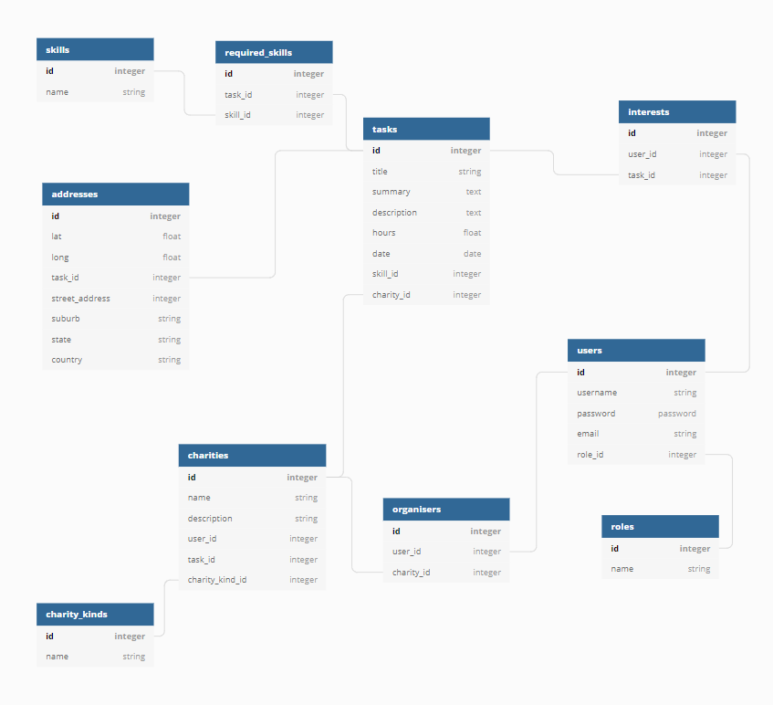

### :open_file_folder: R18 Discuss the database relations to be implemented in your application

The database entities and relations implemented in my application were as follows:

#### Tasks

My database is centred around the `tasks` model. This represents a single request for assistance posted by a charity/community group. It contains a unique id integer as the primary key and contains other attributes that describe the task such as title, a short summary, a longer description, hours and date.

#### Skills & required_skills

I wanted to be able to make a list of skills required for each task so charities could get targeted skills and volunteers could see if the task was suitable to them. These could include things like baking, carpentry, car license, working with children check etc. I created a `skills` table that had a unique id number as the primary key and a name of the skill as an attribute. A task could require many skills and skills could be assigned to many tasks.

I decided `tasks` and `skill`s had a **many-to-many** relationship so created a joining table called `task_skills` to connect them this. This table would contain the foreign key task_id and the foreign key skills_id to reference both. This means that:

- task *has_many* skills *through* task_skills
- skills *has_many* tasks *through* task_skills
- task_skills *belongs_to* both skills and tasks

#### Addresses

Each task would need an address so I could show where it was on a map. I chose to break the address into street address (eg 8/120 Spenser Street) suburb, state and country. The address table also had a lat (latitude) and long (longitude) attribute which is generated by geocoder when the address is added.

I debated if country was necessary or if it depended on state as per the third normal form but decided for scalability, if it was to used globally, country would be required and country would not necessarily depend on state. I also decided postcode would not be required as the suburb, state and country combination would be enough to determine the address. I considered breaking street address up further into street number, an integer and street name, a string. However, I know that this format is not consistent with all addresses, especially address conventions used in other countries so I felt having a string was the best option to include all addresses.

I decided that `tasks` and `addresses` had a **one-to-one** relationship. Each task *has_one* address and the address would *belongs_to* one task so I put a task_id foreign key on the address table.

#### Charities

Each task would be for a specific charity. I wanted to include specific information about the charity so volunteers could learn more about the causes they could support. To be consistent with the second normal form, I separated charity from being an attribute of task to a separate `charities` entity. This way I could include information such as the charities name and a description. It has a unique id as a primary key.

I decided a task would be for only one charity but charity could have many tasks coming up so they had a **one-to-many** relationship. A charity *has_many* tasks and a task *belongs_to* a charity so I put a foreign key on the tasks table.

#### Organisers

I intially I decided to grant edit and delete privledges to the user who had created a task but once my app was at an MVP I thought in a real life there may be a number of peole who run a particular charity and to may be useful if all of them could update tasks and edit their information on the charity, not just the person who first created the task. Additionally someone might be an organiser at more than one charity. I decided to create an 'organisers' table as a joining table between charities and users. It would have an id as a primary key and the foreign key of user_id and charity_id to reference both. This way:

- users *has_many* charities *through* organisers
- charitiies *has_many* userss *through* organisers
- organisers *belongs_to* both charities and users

As charities would not want just anyone becoming an organiser of their charity and interfering with their account, adding a user to the organisers table for a charity has to be done by admin. Once I created this I deleted the previous direct relationship between tasks and users as it was not reqluired.

#### Charity_kinds

I initially planned for the charity to have a category/type attribute as a string for example, environmental, social welfare, education etc. There would only be some dozen different kinds of charities that were applicable to the charities so I decided they should be a seperate entity `charity_kinds`. As the app grew further this could then be referenced and I imagined more information about the kinds of charities being added and referenced. Charities currently have a **one-to-many** relationship with charity-kind as a charity *belongs_to* a charity-kind but a charity-kind *has_many* charities so the foreign key charity_kind_id was put on the charity table.

#### Users

I debated the relationship between `users` and `tasks` based on the functionality I wanted the application to have. The user model represents a person using the app, whether they be a volunteer, a contact person for a charity or both. It has attributes including a username, encrypted password and email. I considered adding a more comprehensive profile such as phone number, picture, skills. Whilst this might be utilised if the app was developed further, with the timeframe available I decided it was unnecessary and thus, in accordance with the Privacy Act, the app shouldn't store more personal information than necessary. I considered making the email a primary key due to it’s unique nature but decided should a user change emails or want to update their email, a unique id number would be better.

#### Interests

I wanted a user to be able to volunteer or express interest in a task. This would be a different relationship to the direct relationship between a user creating a task as above. A user could be interested in many tasks and a task could have many interested users. I decided they had a **many-to-many** relationship between `tasks` and `users` through a joining table, called `interests`. This means that:

- `user` *has_many* tasks *through* `interests`
- `task` *has_many* interested `users` *through* `interests`
- `interests` would *belong_to* `tasks` and `users`
- `interests` would have the foreign key for both in addition to a unique id number as the primary key.

#### Roles

All users must be logged in in to use the app but before someone could start posting tasks, I wanted a way to confirm that they were a real person and legitimate. I created a roles table with three options, general, organiser and admin. When someone first logs in they are assigned general, if they contact the developer, they can be upgraded to orgniser which entitles them to create tasks for a charity. They must still be added to the organisers table for each charity they want to be able to post and edit for.

If I had more time I would like to develope it further where a fourth role was created. This would represent the manager of a charity and they would have extra privleges to add and delete other members as organisers. At the moment it can only be done by admin.

### :open_file_folder: R17 Describe your projects models in terms of the relationships (active record associations) they have with each other

#### Final models and associations

The models I have in my application are:

- addresses
- charities
- charity_kinds
- interests
- organisers
- required_skills
- roles
- skills
- tasks
- users

Their relationships are:

```
Table tasks {
  id integer [pk, increment]
  title string
  summary text
  description text
  hours float
  date date
  skill_id integer
  charity_id integer
}

Table users {
  id integer [pk, increment]
  username string
  password password
  email string
  role_id integer
}

Table skills {
  id integer [pk, increment]
  name string
}

Table charity_kinds {
  id integer [pk, increment]
  name string
}

Table required_skills {
  id integer [pk, increment]
  task_id integer
  skill_id integer
}

Table addresses {
  id integer [pk, increment]
  lat float
  long float
  task_id integer
  street_address integer
  suburb string
  state string
  country string
}

Table interests {
  id integer [pk, increment]
  user_id integer
  task_id integer
}

Table roles {
  id integer  [pk, increment]
  name string
}

Table organisers {
  id [pk, increment]
  user_id integer
  charity_id integer
}

Table charities {
  id integer [pk, increment]
  name string
  description string
  user_id integer
  task_id integer
  charity_kind_id integer
}
```

```
Ref: "users"."id" < "interests"."user_id"

Ref: "tasks"."id" < "interests"."task_id"

Ref: "charities"."id" < "tasks"."charity_id"

Ref: "tasks"."id" < "required_skills"."task_id"

Ref: "required_skills"."skill_id" < "skills"."id"

Ref: "charities"."charity_kind_id" < "charity_kinds"."id"

Ref: "addresses"."task_id" < "tasks"."id"

Ref: "users"."role_id" < "roles"."id"

Ref: "organisers"."user_id" < "users"."id"

Ref: "organisers"."charity_id" < "charities"."id"
```

#### Initial plan

Initially I had a solid idea of what I wanted my application to achieve but was unsure of how to do structure it. This would determine what the models and relationships I would need. After sketching my first rough ERD, see below, I found that there were some core questions about the functionality I had to answer, and in some case changed as I developed the app.

Originat concept - evolved into the ERD in Question 19

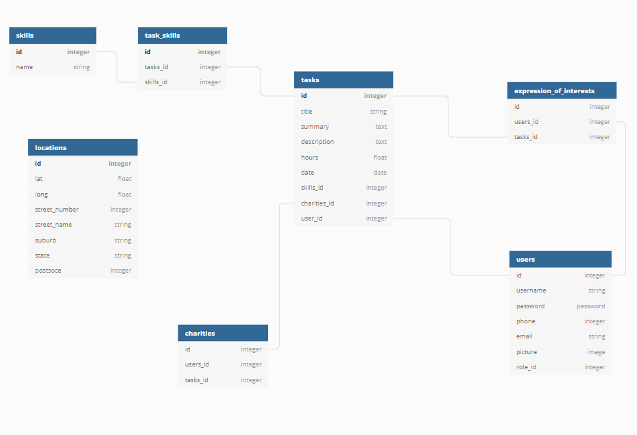

#### Clarifying questions

Firstly, would the person who lists the task be a charity or a user? Would they be a charity with a charity account specific to that charity or would they be an individual with a personal account. Did I need:

- a single `users` entity that could post and register for tasks, or
- two separate `charities` and `volunteers` entities with separate functionality.

This would also determine the relationship between the users and the tasks that were created.

Secondly, I imagined the app would be used in real life once a volunteer found a task they were interested in. I wanted volunteers to be able to register an interest in a task and for their contact email to then be accessible to the charity to contact them with further information. I wanted the volunteer to see a list of tasks they had registered an interest in and a charity to see a list of interested volunteers for each task. I needed a reference of users who were interested in the task. A user should be able to see a list of all tasks they have volunteered for and add or delete tasks from this list.

To achieve this I created a `interests` table that references a user expressing an interest in a task. I initially called this table `eois` (expression of interests) however I was not sure that this abbreviation would be clear to other developers. After researching on abbreviations.com I found eoi could also stand for:

- Explode On Interrupt
- Export Oriented Industry
- European Ombudsman Institute
- Egyptian Olympiad in Informatics
- Earth Orbit Insertion (NASA)
- End Of Injection

Hence I renamed it `user_tasks` and then `interest` for clarity.

Thirdly, I needed someway to control who could edit and delete tasks that had been created. I didn't think anyone should be able to edit and delete all posts. I initially decided the simplist way to do this was grant access only to the author of the post. I made a one to many direct relationship between task and user and delegated access privledges to edit and delete only to the author of the task. Once I had this an a MVP standard I thought that in real life, there may be multiple peole in a charity and it would be useful if they could all manage tasks associated with that charity. Additionally someone may be associated with more than one charity and want to manage posts for both. I created a many to many relationship between users and charities through a joining table called organisers. If a user was confirmed legitimate, their role could be updateed to 'organiser and they would added to the organiser table with id of the charity they were associated with. They could edit and delete all tasks associated with that charity along with amend information about that charity.

Lastly, I wanted to be able to list skills required to help charities attract suitable volunteers and volunteers to feel confident that they were able to fulfill the role. Would a task be specific to each skill where the information could be tailored, or would it be better than multiple skills could be referenced? If a charity had an event that they needed multiple skills for, it would be quicker for them if they didn't have to create multiple listings. However if they needed multiple skills, would they know if the interest they received was for all the required skills. For example, if they were planning a bake sale, they might need people:

- who can bake
- with a drivers license to transport equipment
- with basic construction skills to set up a stage
- with cashier skills to oversee money practises
- unskilled assistance for selling products

It would be time consuming for the charity to have to post 5 times rather than once but they might also want to know the interest they receive meets the skills eg, not everyone has construction skills and no-one bakes.I decided to go with multiple skills to make the process efficient for the charity and if I was to further develop the app I would like to add the functionality that when a user registers, they can select the skills they want to contribute.

Once I was able to answer these questions, I was able to refine my ERD as showed in question 19 and settle on the models and relationships for the application.

### :calendar: R20 Describe the way tasks are allocated and tracked in your project

#### Overall

I knew planning and task allocation would be critical to this project to balance what I hoped to achieve and the timeframe allocated. I spent the first day and a half planning my time and how I would achieve a project that meet MVP in the timeframe.

First, I had to work out what I considered an MVP. I knew I wanted to develop an app that would contribute to social good by encouraging people to volunteer and connect in their local community, and, at the same time, assist charity and community groups struggling to meet the unprecedented demand due to COVID19. I used user stories to tease out the problem and help determine what functionality I wanted the app to have as an MVP and as a stretch goal if I had time.

#### Big picture

I first planned the ‘big-picture’ work that I needed to do in a logical order on a calendar allowing for plenty of time to get to MVP before the deadline, fix bugs, and then work on extra features if I had time. This gave me goals to reach and meant I could compare where I was at the start of each day with where I planned to be and make adjustments early if I was having issues.

I participated in class stand-ups (virtually) and did one myself on mornings we didn’t have one. I found they were a concise way to review what I had done yesterday, what I wanted to achieve that day, what blockers I had and how my progress compared to my plan. This way I could monitor my progress, get help early and adapt my plan as necessary.

An example of this was on Monday the 9th I was working on my models and schema but as I started to develop the code I felt that they were not correct. I reviewed my ERD from Friday and thought it needed amending. I had planned to finish this on Friday and it was a core part of the app so before continuing with other tasks like searching that I had planned for that day, I stopped and worked on fixing the ERD. I started getting confused between the functionality of tasks and users so sought help from my educators, talked through my problem and looked for ways to simplify the diagram. Once I sorted the core problem I adjusted my timing plan accordingly and then felt comfortable to continue with secondary tasks like the searching feature.

#### Detailed

I used a Trello board for a detailed breakdown of tasks that needed to be completed. I divided planned tasks down into user stories, assignment requirements such as the slide deck and ‘pretty bits’/stretch goals. I also kept a list of bugs I could quickly add to and come back to at an appropriate time. I labelled each task with a High-Medium-Low priority and a Start-Midway-Final-Ongoing phase to help me visually see what I should be working on and at what stage. I set deadlines for tasks consistent with my calendar plan so I could easily see where I needed to focus attention or adapt my plan. I moved cards to ‘doing’ when I was working on them and ‘done’ when complete.

#### Deployment

Heeding advise from my educators; I also deployed my app to Heroku a week before it was due and redeployed regularly. This helped me catch any bugs when deployed to Heroku that I had not found running my application locally.
