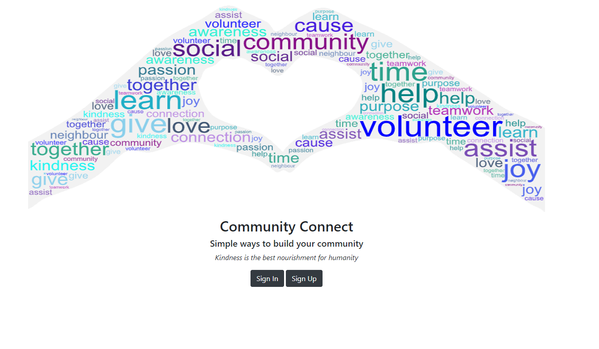

# :handshake: README :handshake:

## :information_source: About

Community Connect is a two sided-marketplace app designed to bring people willing to volunteer their time together with local charities or community groups. It was developed in accordance with the requirements of Coder Academy T2A2 Marketplace Project.

## :link: R9 R10 Links for this app

Github - <https://github.com/bronwyncarr/marketplace>

Heroku - <https://volunteer-marketplace.herokuapp.com/>

## :thinking: The need for volunteers

Volunteers are relied upon to provide many services and functions critical to Australian society. Most notably, in Australia over 3 million people live below the poverty line and almost half of them regularly rely on food relief. However, almost everyone in Australia would draw benefit from the wide range of services charities and local community groups provide. These include services such as: keeping beaches safe, looking after elderly, fighting fires, running local facilities, accessing medical care and championing equality; in fact, there are over 50,000 Australian registered charities.

A report by Volunteering Australia cited some of the common barriers people faced to volunteering were:

- Did not have time – 67%
- Unable to make a long-term commitment – 62%
- No one asked – 45%
- Did not know how to become involved – 22%

Many charities are completely reliant on volunteers and are facing unprecedented demand for assistance. In addition to the social benefits, volunteer contribute billions of dollars to the Australian economy and in general, personally benefit from an increase to their physical and mental wellbeing.

## :clipboard: Details of the app including

### :bulb: Purpose

The purpose of this app is to connect charities/community groups and volunteers. It will remove some of the barrier’s volunteers face, allow charities to raise awareness and support local connections. Charities can register requests for assistance for a specific task which volunteers register for on a one-of basis. Volunteers can become aware of what opportunities exist in their local area and see the date, time commitment and skills required. This will remove some of the barriers identified.

| Problem | Targeted solution |
| ------------- | ------------- |
| Did not have time | Volunteers can see the time commitment and date so they can fit it around a busy or unpredictable schedule without on-going commitment |
| Unable to make a long-term commitment | Volunteers make a one-off commitment to a specific task with no on-going requirment |
| No one asked | Community groups can post requests for assistance |
| Did not know how to become involved | Raises awareness of the volunteering opportunities |

Benefits include:

- Assist charities to find volunteers to help complete task
- Raise awareness of the importance role charities play in our society
- Allows people to build social connections within their local community
- Allow people to give back to their community
- Encourage people to be considerate of others
- Encourages bridging social and cultural divides by bringing people together
- Allows people to share knowledge and learn new skills
- Encourages a sense of achievement by being able to contribute to specific tasks
- Encourages a sense of fulfilment by assisting others
- Enables more people to be involved in their community who might previously not been

### :sparkles: Features

The app will allow charities to log in and post information on a one-off request for assistance such as building garden beds at a neighbourhood house or holding a second-hand book sale and volunteers can express interest in volunteering for these events.

Everyone must have an account and log in to use the app. There are three incremeintal roles a user can have.

| User | Permissions |
| ----------- | --------- |
| General | Can view requests and express interest. Can create a charity however the charity won't be able to post requests until approved by admin. |
| Organiser | General permissions + can CRUD request for all charities they are associated with. Can edit charity information and view who has expressed intrerests in tasks. Must be approved by admin to become organiser to confirm legitimate. Also must be added to organisers table for each charity they want to be associated with. |
| Admin | Has total control to manage content. Must approve organiser role and update users in organisers table with the charity they represent. |

Anyone who is approved by admin as an organiser and either created the charity themselves or approved by admin as part of that charity, can manage all functions of that charity. A user may be an organiser at more than one charity. They can post requests including a picture, title, summary, description, date, time commitment, list of skills required, address and a map. Anyone who is an organiser of that charity can see a full list of all requests made by that charity and update or delete these details at any time. Requests are sorted into upcoming (today onwards) or previous. Requests do not time expire for potential data analytical purposes.

Volunteers can log in and see a list of all the requests for assistance sorted by date. They can search for a particular task by name or by the skillset. They can click on a request to get more information about what is required including the time commitment, date, skills required and location. If they are interested in a task they can register.

If a volunteer registered their interest in a task an email will be sent to them confirming this and it will be added to the expression of interests list. Volunteers can view a list of EOIs for their records and modify this list.

Any organiser of a charity can view a list of the contact details of everyone who has expressed interest in each task associated with that charity so they can contact them with further information or to make arrangements. An orgasniser can also update the information about the charity, it's picture, category or description.

To demonstrate the features I have seeded data and created 3 basic logins:

| Role | Username | Password |
| ------------------ | ----------------- | ----------|
| General | a@test.com | 123456 |

### :raising_hand: Target audience

This app is targeted people who wish to volunteer and charities or local community groups who require assistance. The app will appeal to those who already actively volunteer in their community but is also designed to break down some barriers to volunteering and encourage more people to become involved. This will include people who previously:

- were unaware of non-stereotypical volunteer opportunities that they could do
- thought they didn’t have the time or availability
- didn’t want to make an ongoing commitment
- thought they didn’t have any useful skills to help
- thought there wasn’t a need
- want to help but didn't know how/where to start

Target audience examples might include:

- Charity/local groups who need extra assistance
- Charity/local groups who require an increase in demand such as in lead up to Christmas
- Charity groups who require a task outside the skillset of their normal volunteers
- People who want to build social connections in their community especially if they now work from home/lost their job due to COIVD19 or are new to the area.
- People who want to volunteer as a family but need tasks suitable to their family
- People who want to volunteer but at a time convenient to them without an ongoing commitment
- People who want more information about what is required before having to commit

### :computer: Techstack

Teck stack used for this project is:

| Tech | Usage |
| ------------- | ------------- |
| Ruby on Rails | Back end |
|Javascript | Dynamic content |
| Postgres database | Relational database |
| HTML with EMB | Controls the content to be displayed |
| Bootstrap CSS | Framework for most styling |
| SASS | In addition to bootstrap for additional styling |

| Other | Usage |
| ------------- | ------------- |
| Heroku | Deployment |
| Github | Version control |
| Trello | Project management planning |

Third party services including:
- AWS S3
- Bootstrap
- CanCanCan
- Devise
- Geocoder
- GoogleMaps API
- Leaflet
- Map Box
- Rubocop-rails

### :world_map: Sitemap

### :camera: Screenshots

Home page:

Sign in page:

Sign up page:

Index page desktop:

Index page mobile:

Show Task Part 1:

Show Task Part 2:

Interests Index:

Index of Charities:

Requests made by user's Charities:

Charitites record of interests in their request:

Creating a new request Part 1:

Creating a new request Part 2:

Edit a request Part 1:

Edit a request Part 2:

